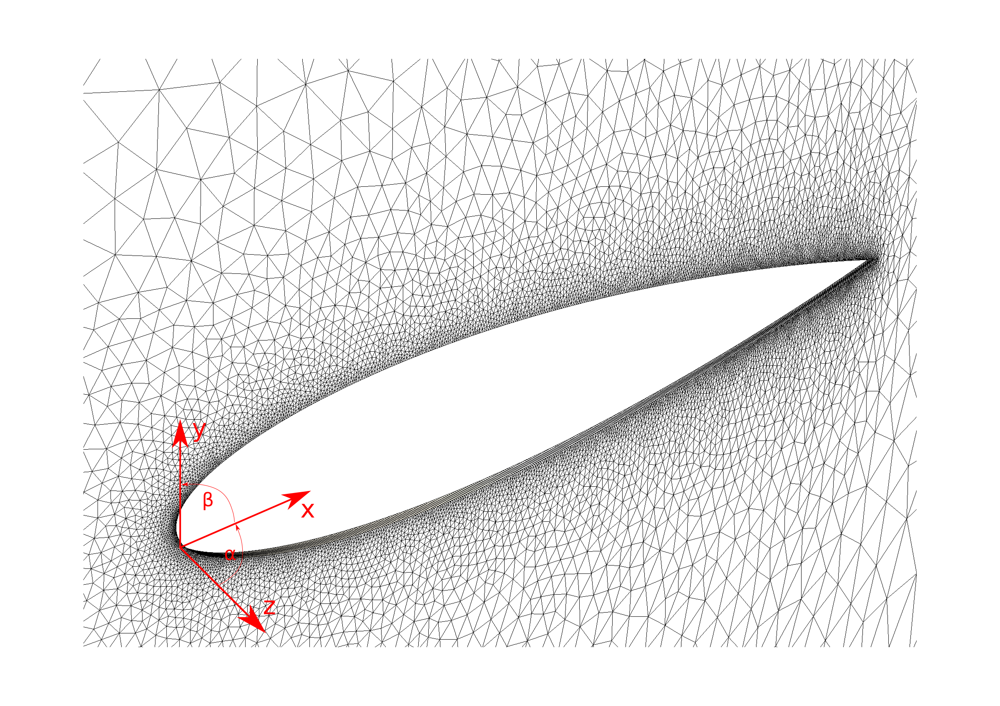

#Sensitivity Analysis test-cases

This folder contains all test-cases for the Sensitivity Analysis framework of [AERO-F](http://frg.bitbucket.org/aero-f/index.html).


##General

A variety of parameter combinations has to be tested in order to ensure full functionality of the SA framework.
All calculations evaluate the sensitivity of the Lift and Drag(LD) with respect to the parameters listed below.

We test the follwowing features:

- Equation type
   - Euler equations
   - Laminar Navier-Stokes equations
   - RANS equations
- Time formulations
  - Eulerian
  - Arbitrary Lagrangian Eulerian
- Sensitivity Analysis Method
  - Direct SA
  - Adjoint SA
- Sensitivity Type
  - Shape sensitivity
  - Mach sensitivity
  - AoA sensitivity

##Setup
All calculations are performed on a NACA0012 airfoil mesh as depicted below.


##Structure
This repository splits into 3 subfolders that cover the different sensitivity types listed above:
- [./shapesens](shapesens) covers sensitivity with respect to shape variables [README](./shapesens/README.md)
- [./machsens](machsens) convers LD sensitivity with respect to the free-stream mach number [README](./machsens/README.md)
- [./alphasens](alphasens) covers LD sensitivity with respect to the angle of attack [README](./alphasens/README.md)

Each folder contains subfolders for Euler-bodyfitted, Laminar-bodyfitted and RANS-bodyfitted simulations which we refer to as "simulation-types".

For each simulation-type a variety of parameters is varied. The variation of paramters is triggered via small textfiles in [simulation-type]/scriptinput.
This is the connection between the textfiles and the paramters beeing varied:

| filename | varied parameter |
|----------------|---------|
| angles | Angle of attack |
| machnumers | Free stream mach number |
| perturbation | Stencil size for the FD validation |
| shapevariables | Indices of the abstract shape parameters being tested |

##Usage
Each folder contains a template folder for the analytic simulations: "template_ana" and a template folder for the FD validation" "template_sim". Once you have adjusted the scriptinput files to your needs, everything will done automatically by running the followng scripts in the right given order:

1) Make sure remanants of previous simulations are deleted:
```{r, engine='bash', count_lines}
./deletefolders.sh
```
2) generate the analytic and FD simulation folders. A generic folder naming scheme will be applied, but you will not have to deal with it.
```{r, engine='bash', count_lines}
./genfolders.sh
```
3) Every generated folder will contain 2 simulations: Direct and Adjoint Sensitivity analysis for the parameter combination associated with that folder. Run all simulations on the Sandybridge queue of independece by typing:
```{r, engine='bash', count_lines}
./runall.sh
```
4) Proceed as soon as all calculations have finished. You can check the status of the queue anytime by typing
```{r, engine='bash', count_lines}
qstat -a
```
5) Every generic folder will contain it's results in it's subfolder "results". A Python script is used now to do the actual Finite Difference calculation. Also the results of different stencil sizes will be collected into one single file. The results will go into [simulation-type]/results.
```{r, engine='bash', count_lines}
python2.6 ./calc.py
```
6) Plot the resutls in an automated way. A Python script is used to collect the information of the just created .csv-files and plot them into .png-images. The images will provid a quick visual comparison of the FD and the analytic results. The plots will be automatically annotated. They will be stored into [simulation-type]/results/[machnumber]
```{r, engine='bash', count_lines}
python2.6 ./plot.py
```
7) At this point you can safely delete all the generated generic subfolders to clean up the simulation-type folder. This will not delete the simulation results or plots, since they are stored in [simulation-type]/results .


##Results

The following table summarizes the Verification of results.

<table class="tg" style="undefined;table-layout: fixed; width: 510px">
<colgroup>
<col style="width: 79px">
<col style="width: 56px">
<col style="width: 45px">
<col style="width: 45px">
<col style="width: 45px">
<col style="width: 45px">
<col style="width: 45px">
<col style="width: 45px">
<col style="width: 45px">
<col style="width: 45px">
<col style="width: 45px">
</colgroup>
  <tr>
    <th class="tg-031e" colspan="2" rowspan="2"></th>
    <th class="tg-hgcj" colspan="3">Euler</th>
    <th class="tg-amwm" colspan="3">Laminar</th>
    <th class="tg-amwm" colspan="3">RANS</th>
  </tr>
  <tr>
    <td class="tg-s6z2">s</td>
    <td class="tg-s6z2">α</td>
    <td class="tg-s6z2">Ma</td>
    <td class="tg-baqh">s</td>
    <td class="tg-baqh">α</td>
    <td class="tg-baqh">Ma</td>
    <td class="tg-baqh">s</td>
    <td class="tg-baqh">α</td>
    <td class="tg-baqh">Ma</td>
  </tr>
  <tr>
    <td class="tg-e3zv" rowspan="2">ALE</td>
    <td class="tg-031e">Direct</td>
    <td class="tg-031e"> <a href="shapesens/ALE_Euler/results">✓</a> </td>                 <!-- ALE-Direct-Euler-s -->
    <td class="tg-031e"> <a href="alphasens/ALE_Euler/results">✓</a> </td>                 <!-- ALE-Direct-Euler-α -->
    <td class="tg-031e"> <a href="machsens/ALE_Euler/results">!</a> </td>                 <!-- ALE-Direct-Euler-Ma -->
    <td class="tg-yw4l"> <a href="shapesens/ALE_Laminar/results">✓</a> </td>                 <!-- ALE-Direct-Laminar-s -->
    <td class="tg-yw4l"> <a href="alphasens/ALE_Laminar/results">✓</a> </td>                 <!-- ALE-Direct-Laminar-α -->
    <td class="tg-yw4l"> <a href="machsens/ALE_Laminar/results">!</a> </td>                 <!-- ALE-Direct-Laminar-Ma -->
    <td class="tg-yw4l"> <a href="shapesens/ALE_RANS/results">✓</a> </td>                 <!-- ALE-Direct-RANS-s -->
    <td class="tg-yw4l"> <a href="alphasens/ALE_RANS/results">✓</a> </td>                 <!-- ALE-Direct-RANS-α -->
    <td class="tg-yw4l"> <a href="machsens/ALE_RANS/results">!</a> </td>                 <!-- ALE-Direct-RANS-Ma -->
  </tr>
  <tr>
    <td class="tg-031e">Adjoint</td>
    <td class="tg-031e"> <a href="shapesens/ALE_Euler/results">✓</a> </td>                 <!-- ALE-Adjoint-Euler-s -->
    <td class="tg-031e"> <a href="alphasens/ALE_Euler/results">!</a> </td>                 <!-- ALE-Adjoint-Euler-α -->
    <td class="tg-031e"> <a href="machsens/ALE_Euler/results">!</a> </td>                 <!-- ALE-Adjoint-Euler-Ma -->
    <td class="tg-yw4l"> <a href="shapesens/ALE_Laminar/results">✓</a> </td>                 <!-- ALE-Adjoint-Laminar-s -->
    <td class="tg-yw4l"> <a href="alphasens/ALE_Laminar/results">!</a> </td>                 <!-- ALE-Adjoint-Laminar-α -->
    <td class="tg-yw4l"> <a href="machsens/ALE_Laminar/results">!</a> </td>                 <!-- ALE-Adjoint-Laminar-Ma -->
    <td class="tg-yw4l"> <a href="shapesens/ALE_RANS/results">✓</a> </td>                 <!-- ALE-Adjoint-RANS-s -->
    <td class="tg-yw4l"> <a href="alphasens/ALE_RANS/results">!</a> </td>                 <!-- ALE-Adjoint-RANS-α -->
    <td class="tg-yw4l"> <a href="machsens/ALE_RANS/results">!</a> </td>                 <!-- ALE-Adjoint-RANS-Ma -->
  </tr>
  <tr>
    <td class="tg-9hbo" rowspan="2">Embedded</td>
    <td class="tg-yw4l">Direct</td>
    <td class="tg-yw4l">?</td>                 <!-- Embedded-Direct-Euler-s -->
    <td class="tg-yw4l">?</td>                 <!-- Embedded-Direct-Euler-α -->
    <td class="tg-yw4l">?</td>                 <!-- Embedded-Direct-Euler-Ma -->
    <td class="tg-yw4l">?</td>                 <!-- Embedded-Direct-Laminar-s -->
    <td class="tg-yw4l">?</td>                 <!-- Embedded-Direct-Laminar-α -->
    <td class="tg-yw4l">?</td>                 <!-- Embedded-Direct-Laminar-Ma -->
    <td class="tg-yw4l">?</td>                 <!-- Embedded-Direct-RANS-s -->
    <td class="tg-yw4l">?</td>                 <!-- Embedded-Direct-RANS-α -->
    <td class="tg-yw4l">?</td>                 <!-- Embedded-Direct-RANS-Ma -->
  </tr>
  <tr>
    <td class="tg-yw4l">Adjoint</td>
    <td class="tg-yw4l">?</td>                 <!-- Embedded-Adjoint-Euler-s -->
    <td class="tg-yw4l">?</td>                 <!-- Embedded-Adjoint-Euler-α -->
    <td class="tg-yw4l">?</td>                 <!-- Embedded-Adjoint-Euler-Ma -->
    <td class="tg-yw4l">?</td>                 <!-- Embedded-Adjoint-Laminar-s -->
    <td class="tg-yw4l">?</td>                 <!-- Embedded-Adjoint-Laminar-α -->
    <td class="tg-yw4l">?</td>                 <!-- Embedded-Adjoint-Laminar-Ma -->
    <td class="tg-yw4l">?</td>                 <!-- Embedded-Adjoint-RANS-s -->
    <td class="tg-yw4l">?</td>                 <!-- Embedded-Adjoint-RANS-α -->
    <td class="tg-yw4l">?</td>                 <!-- Embedded-Adjoint-RANS-Ma -->
  </tr>
</table>


where: 
- s Shape sensitivity
- α AoA sensitivity
- Ma Mach number sensitivity

and the results can be read as follows:
- ✓ Everything working properly
- ! Implemented, running, but wrong results
- ~ Implemented but not working(segfault, floating-point exception, etc.)
- ✕ Not implemented
- ? Not tested yet
