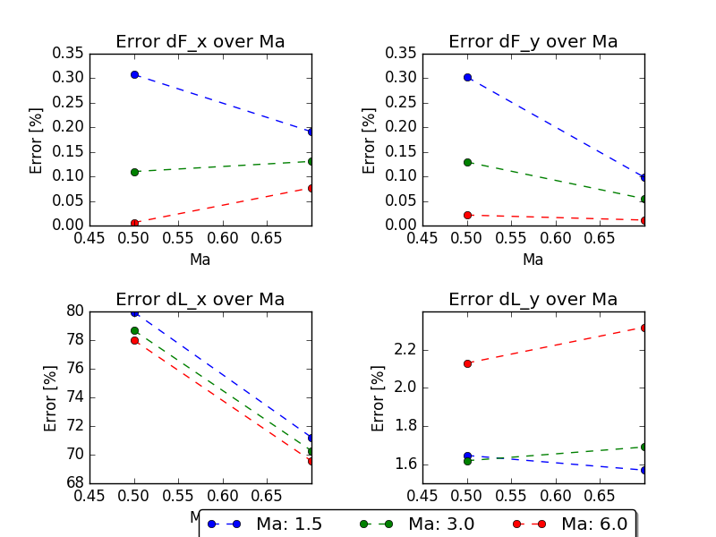
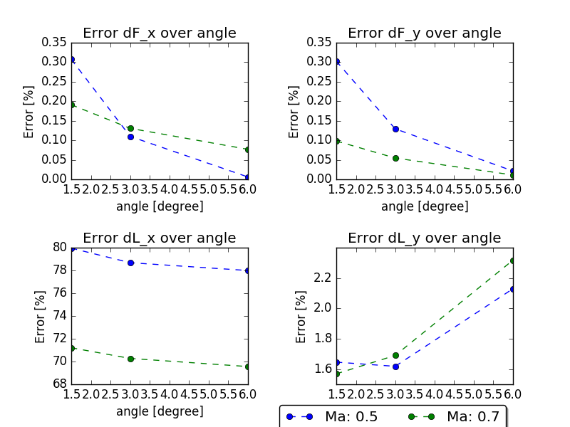

#Results
All results from the calculations are stored here via .csv-files
Detailed results for every calculations are found in the 'Ma*'-folders.
A quick comaprison and summary can be found in [compare](compare)

## Error dependency on inflow mach-number:

## Error dependency in angle of attack:

